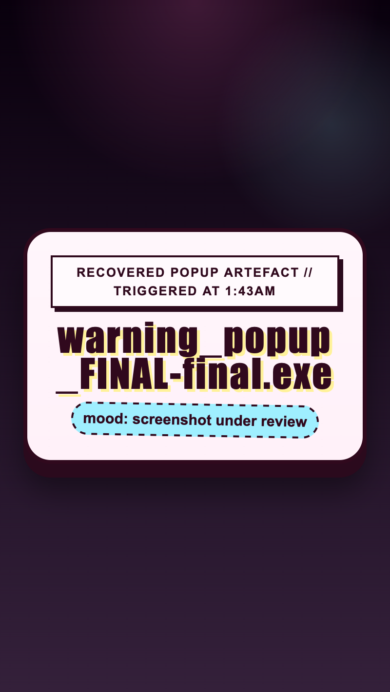

<h2 class="c-project-heading--task">Name the page and the button</h2>

You will change the tab title and the button label so the page already feels a bit more goblin-like.

Open `index.html` and change the text in the `<title>` tag and the `<button>` tag.

--- code ---
---
language: html
filename: index.html
line_numbers: true
line_number_start: 1
line_highlights: 6,13
---
<!doctype html>
<html lang="en">
  <head>
    <meta charset="utf-8">
    <meta name="viewport" content="width=device-width, initial-scale=1">
    <title>Goblin Alert Button</title>
  </head>
  <body>
    <main>
      <h1>One rude little browser alert</h1>
      
Press the button if you would like the browser to announce something completely harmless.

      <!-- Change the label on this button. -->
      <button type="button">Press for goblin news</button>
    </main>
  </body>
</html>
--- /code ---

<h2 class="c-project-heading--task">Test</h2>

**Run your code:** You should see your new button label on the page, and the browser tab title should change too.

  

