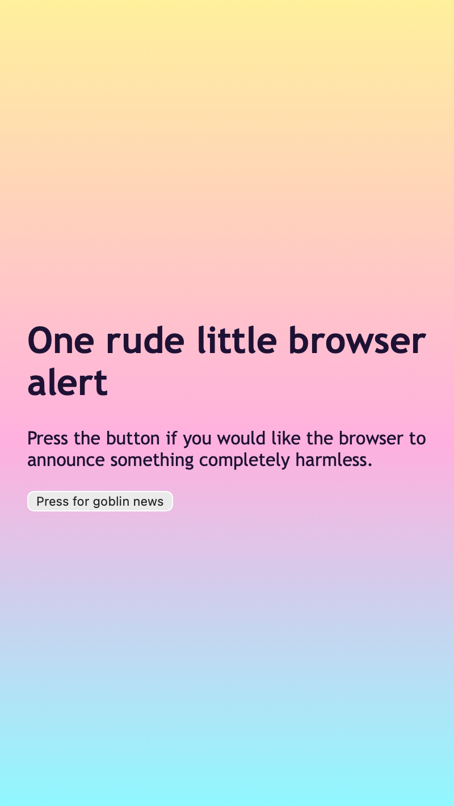

<h2 class="c-project-heading--task">Add the page background</h2>

You will centre the page on a bright background so the button has room to stand out.

### Step 1

Stay in `index.html` and add the start of your `
  </head>
</html>
--- /code ---

<h2 class="c-project-heading--task">Test</h2>

**Run your code:** You should now see the page centred on a loud background, even though the content still looks plain.

  

