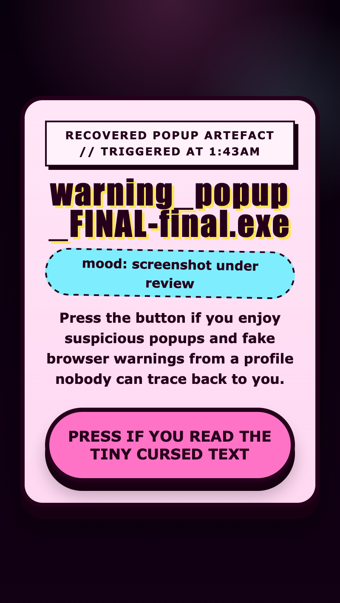

<h2 class="c-project-heading--task">Style the button</h2>

You will make the button big and obvious so it feels like the one thing this page is begging you to press.

Still inside the `<style>` block, add the button styles.

--- code ---
---
language: html
filename: index.html
line_numbers: true
line_number_start: 43
line_highlights: 43-54
---
      button {
        margin-top: 20px;
        padding: 18px 24px;
        border: 4px solid #1e1234;
        border-radius: 999px;
        background: #ff63b5;
        color: #1e1234;
        font: inherit;
        font-size: 1.1rem;
        font-weight: 900;
        cursor: pointer;
        box-shadow: 0 8px 0 #1e1234;
      }
--- /code ---

<h2 class="c-project-heading--task">Test</h2>

**Run your code:** You should now see one large button that looks much more fun to click.

  

