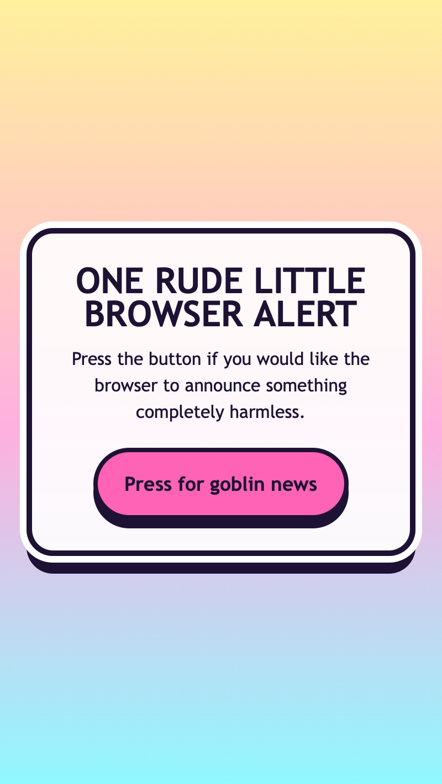

<h2 class="c-project-heading--task">Make the browser react</h2>

You will add one inline script that makes the button open a browser-owned alert when it is clicked.

### Step 1

Add this `
  </body>
</html>
--- /code ---

The popup belongs to the browser, so you do not style it with CSS. If you test it, keep the page tab active because browsers can behave differently when a page is in the background.

<h2 class="c-project-heading--task">Test</h2>

**Run your code:** When you click the button, the browser should show your silly alert message.

  

