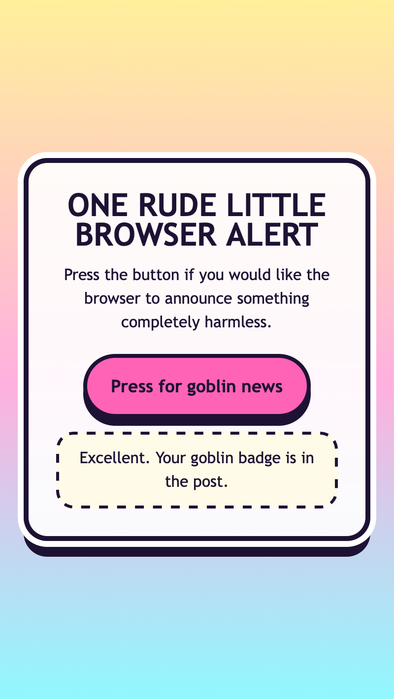

<h2 class="c-project-heading--task">Challenge: make the page choose an outcome</h2>

If you want to stretch the project, turn your alert button into a yes-or-no confirm button that writes one of two silly results on the page.

### Step 1

Inside `<main>`, add a result paragraph underneath the button so the page has somewhere to show the answer.

--- code ---
---
language: html
filename: index.html
line_numbers: true
line_number_start: 70
line_highlights: 75-76
---
  <body>
    <main>
      <h1>One rude little browser alert</h1>
      
Press the button if you would like the browser to announce something completely harmless.

      <button type="button">Press for goblin news</button>
      

    </main>
--- /code ---

### Step 2

Still inside the `<style>` block, add the `#result` rule underneath the `button` rule so the message has a visible box.

--- code ---
---
language: html
filename: index.html
line_numbers: true
line_number_start: 47
line_highlights: 61-67
---
      button {
        margin-top: 20px;
        padding: 18px 24px;
        border: 4px solid #1e1234;
        border-radius: 999px;
        background: #ff63b5;
        color: #1e1234;
        font: inherit;
        font-size: 1.1rem;
        font-weight: 900;
        cursor: pointer;
        box-shadow: 0 8px 0 #1e1234;
      }

      #result {
        min-height: 3.2em;
        padding: 12px;
        border: 3px dashed #1e1234;
        border-radius: 18px;
        background: #fffbe8;
      }
--- /code ---

### Step 3

Now replace the old alert script with this one so the browser asks a silly question and the page shows a different result for OK or Cancel.

--- code ---
---
language: html
filename: index.html
line_numbers: true
line_number_start: 80
line_highlights: 83-86
---
    
  </body>
</html>
--- /code ---

The confirm box belongs to the browser, so you do not style it with CSS. If the dialog is ignored, browsers treat the result like Cancel, so the result text should still change sensibly.

<h2 class="c-project-heading--task">Test</h2>

Click the button and the page should show one outcome for OK and a different outcome for Cancel.

  

