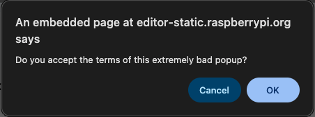

<h2 class="c-project-heading--task">Make the page choose an outcome</h2>

Replace the alert script so the browser asks a yes-or-no question and the page shows one result for OK and another for Cancel.

<h2 class="c-project-heading--explainer">Make this change</h2>

Replace the old script with this version.

--- code ---
---
language: html
filename: index.html
line_numbers: true
line_number_start: 18
line_highlights: 19-22
---
    
  </body>
</html>
--- /code ---

The confirm box belongs to the browser, so you do not style it with CSS. The screenshot below shows one example of how the confirm box might look, and browsers treat ignored dialogs like Cancel.

## Now run your code

Click the button and the browser should show the confirm box. Choose OK or Cancel and the page should then show the matching outcome.

  

